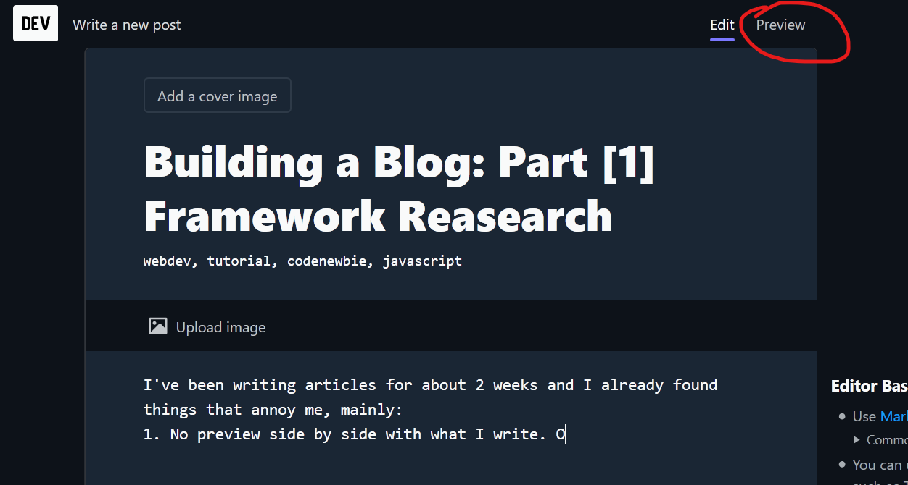
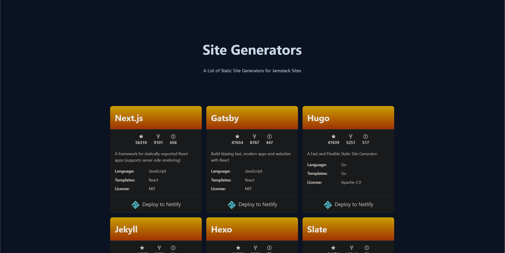

---
url: building-a-blog-part-1-framework-research
title: Building a Blog - Part 1 Framework Research
description: <todo>
date: 2020-11-14
series:
    - Building a Blog
tags:
    - javascript
----------------

## Dev.to annoyances

I've been writing articles for about 2 weeks, and I already found things that annoy me on dev.to, mainly:

1. No preview side by side when writing an article. I have to manually click "Preview" tab each time and then scroll down to the content I want to check.
    

2. The font of the articles is just way too big (20px) and/or the content width is too small (670px).

3. Reddit and HackerNews don't treat dev.to domain well. Each time I post a link there my posts are automatically filtered out.

4. Posting images is very annoying. I cannot copy and paste an image, but first I am required to save it to a disk and then click the "Upload image" button.

5. The gifs uploading has a limitation. Once, I've uploaded a small, but long (30s+) gif and despite a successful upload the app couldn't render it. Only shortening helped.

6. No analytics. All I know is number of "upvotes" and number of views. That's all.

This is why I am going to create my own blog that hopefully will solve these problems.

## Requirements

There are some requirements the framework needs to fulfill. If at least one is not met then it's thrown to a trash.

1. **Instant Page Load** - the content must be already contained inside `.html` file, so that user does not wait.
2. **Lightweight** - only the most necessary files are downloaded. No JS framework bloatware weighing 200 kB. IT'S LITERALLY JUST A BLOG!
3. **Full customization** - I can add whatever features I want. Custom upvoting? No problem. Mining bitcoins? There you go :)
4. **Markdown as a render source** - No writing in custom formats. Or even worse, in raw HTML.
5. **Markdown preview** - When editing I want to have a live preview of what is happening in the layout.
6. **Copy/Paste image/gif upload** - I don't want to waste time saving files manually to my computer.

## Research

Before I start the implementation I need to find which framework, or not, to use. It's going to be a static site generator instead of a traditional JS framework rendered on the client side. But first we need to know what a static site generator is.

### Static Site Generator

Normally when we use Angular, React or Vue there is only 1 `index.html` generated even if the app has 50 pages.  
This file is very tiny and contains only links to the necessary scripts and styles, so depending on how we configured the router in the app,  
the browser would need to fetch 3 js scripts to render a page, where before fetching the next one it needs to wait for the previous one to complete.

In case of my new blog this is UNACCEPTABLE!  
To fix this problem the compiler needs to spit an `index.html` file out **for every page**.  
Inside that HTML file the content would be already included, so the browser wouldn't need to fetch additional scripts.  
Of course we can add our custom `.js` files, but it's totally up to us. And this my friends is a **Static Site Generator**.

### Jamstack

For a list of available frameworks I used Jamstack https://jamstack.org/generators.

I picked 9 of the most popular frameworks and deployed them to [Netlify](https://netlify.com).  
Below is a table representing how much `.js` files they download for a simple static site.  
I haven't changed any of their content, so the demo looks exactly as in the starter kit.

**Note**: I counted only `.js` files, because a content between them differs, and some fetch very large jpg files,  
 but at the end it's just a content, which will finally I will change anyway.

| Framework | # .js files | Weight | Repo | Preview |
|-----------|-------|--------|------|---------|
| [Next.js](https://nextjs.org/) (React) | 8 | 201 kB | [repo](https://github.com/Humberd/next-starter-jamstack) | [preview](https://humberd-nextjs.netlify.app/) |
| [Gatsby](https://www.gatsbyjs.com/) (React) | 7 | 207 kB | [repo](https://github.com/Humberd/gatsby-starter-default) | [preview](https://humberd-gatsby.netlify.app/) |
| [React Static](https://github.com/react-static/react-static) (React) | 6 | 241 kB | [repo](https://github.com/Humberd/react-static-starter) | [preview](https://humberd-react-static.netlify.app/) |
| [Hexo](https://hexo.io/) | 3 | 108 kB | [repo](https://github.com/Humberd/hexo-starter) | [preview](https://humberd-hexo.netlify.app/) |
| [Jekyll](https://jekyllrb.com/) | 0 | 0 kB | [repo](https://github.com/Humberd/jekyll-base) | [preview](https://humberd-jekyll.netlify.app/) |
| [Eleventy](https://www.11ty.dev/) | 0 | 0 kB | [repo](https://github.com/Humberd/eleventy-base-blog) | [preview](https://humberd-eleventy.netlify.app/) |
| [Hugo](https://gohugo.io/) | 1 | 4 kB | [repo](https://github.com/Humberd/victor-hugo) | [preview](https://humberd-hugo.netlify.app/) |
| [Vuepress](https://vuepress.vuejs.org/) (Vue) | 2 | 126 kB | [repo](https://github.com/Humberd/vuepress-deploy) | [preview](https://humberd-vuepress.netlify.app/) |
| [Scully](https://scully.io/) (Angular) | 3 | 265 kB | [repo](https://github.com/Humberd/scully-preview) | [preview](https://humberd-scully.netlify.app/) |

> I have also tried Nuxt and Docusaurs, but their Netlify starter projects are broken.

The first thing we can tell is that both Angular, React and Vue based static site generators  
by default ship a bunch of js files despite rendering only a simple static page.  
The most has an Angular version called Scully with 265 kB and the least of them has Vue version called Vuepress with 126 kB.  
The React projects are very close to each other regarding file size.

On the other hand there are 3 projects not related to any modern frontend framework that did extremely well: Jekyll, Eleventy and Hugo.  
They ship without any bloatware and score 0 kB (4 kB of Hugo is a custom script).

The last remaining one is Hexo with a score of 108 kB. All of it is jquery! Why???  
In the project I didn't see any mention of jquery, so it must be imported by default.

## Conclusion

In the first research I've compared my basic requirements for a blog against 9 frameworks.  
Only 3 of them potentially satisfy my needs: Jekyll, Eleventy and Hugo.

1. **Instant Page Load** - ✔ - included in `index.html`
2. **Lightweight** - ✔ - no bloatware
3. **Full customization** - ✔ - full control over `.html` files
4. **Markdown as a render source** - ✔
5. **Markdown preview** - ✔ - I can write in IDE and preview it in the browser
6. **Copy/Paste image/gif upload** - ✔ - There are plugins in IDE that allow pasting images in a markdown.

> I know all the frameworks can be tweaked to not include that much js,  
> but if there are frameworks that work exactly as I want without any configuration then I'll pick them over the other.

In the next article of the `Building a Blog` series I'll check how customizable Jekyll, Eleventy and Hugo.  
Hopefully, I'll pick one of them and start coding, so make sure you click a `Follow` button in order to not miss any future adventures.

If you have any suggestions solving my issues, then writing a comment would be appreciated.

Anyway

See you around

