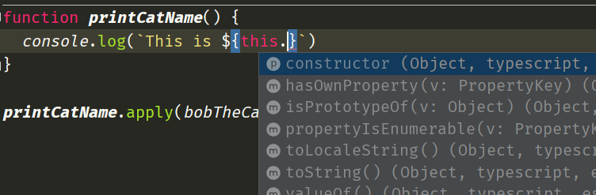
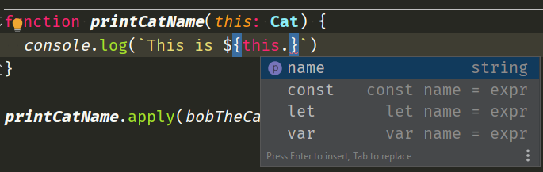

---
url: how-to-statically-type-this-for-a-regular-function-in-typescript
title: How to statically type 'this' for a regular function in TypeScript
description: A cool trick to know when calling a regular function with a `call` or `apply` methods.
banners:
    wide: res/_banner_.png
    narrow: res/_banner_.png
date: 2020-11-09
tags:
    - typescript
----------------

Let's say we have a cat object:

```typescript
interface Cat {
  name: string
}

const bobTheCat: Cat = {
  name: 'Bob'
}
```

And we want to have a function that prints his name. We can do it like a regular developer by consuming a `cat` parameter inside a function:

```typescript
function printCatName(cat: Cat) {
  console.log(`This is ${cat.name}`)
}

printCatName(cat); // This is Bob
```

Simply speaking we get the expected result.

## Problem

However, a function can consume data another way using `this` context:

```typescript
function printCatName() {
  console.log(`This is ${this.name}`)
}

printCatName.apply(bobTheCat); // This is Bob
```

This works exactly the same as the previous way. However, we now lost static typing for `this` variable:



## Solution

Fortunately, TypeScript has us covered. We can write a new function the following way:

```typescript
// we added a pseudo parameter 'this'
function printCatName(this: Cat) {
  console.log(`This is ${this.name}`)
}

printCatName.apply(bobTheCat); // This is Bob
```

And once again we have the same result, but this time we get all the benefits from static typing. Yay!



## `this` as a parameter?

You might ask what would happen if invoke a function without `apply()`? The function has `this` parameter, so we probably need to provide is as well, right?

```typescript
function printCatName(this: Cat) {
  console.log(`This is ${this.name}`)
}

printCatName(bobTheCat);
```

This time we have a compilation error.

```
index.ts:13:14 - error TS2554: Expected 0 arguments, but got 1.

13 printCatName(bobTheCat);
                ~~~~~~~~~
```

This is why I described `this` as a pseudo parameter, because it might look it's a parameter, but in fact it is just a hint to TypeScript.

See you around.


